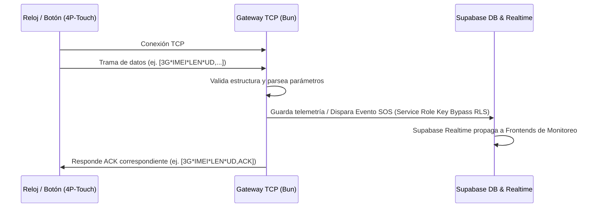

# Guía Completa del Protocolo IoT 4P-Touch (Beesure / SeTracker)

Este documento centraliza todas las capacidades conocidas, comandos bidireccionales, y la estructura de tramas del protocolo de comunicación utilizado por los smartwatches y botones de emergencia de **4P-Touch** para el sistema Angels on Watch (AoW).

---

## 1. Formato de Trama Base

Todas las comunicaciones TCP (tanto de subida como de bajada) utilizan la siguiente estructura delimitada:

```text
[COMPANY*IMEI*LENGTH*DATA]
```

- **COMPANY**: Identificador del fabricante, típicamente `3G` o `CS`.
- **IMEI**: Identificador único del dispositivo (15 dígitos).
- **LENGTH**: Longitud en bytes de la sección `DATA`, codificada como un string hexadecimal de 4 caracteres en mayúsculas (ej: `000A` equivale a 10 bytes).
- **DATA**: El payload del mensaje. Consiste en comandos y parámetros separados por comas. El primer elemento siempre define el **Tipo de Comando** o **ID del Reporte** (ej: `LK`, `UD`, `PHB`).

---

## 2. Reportes del Dispositivo (Dispositivo → Servidor)

El dispositivo inicia la conexión y reporta estados de forma periódica o basados en eventos (como presionar el botón de SOS o una caída).

### 2.1 Keep-Alive / Latido (`LK`)
Utilizado para mantener la conexión TCP abierta y reportar el estado general del dispositivo.
* **Trama:** `[3G*IMEI*000A*LK,gsmSignal,batteryPercent,steps]`
  * *Ejemplo simple:* `[3G*123456789012345*0002*LK]`
  * *Ejemplo con telemetría:* `[3G*123456789012345*000E*LK,95,85,1230]`
* **Acción del Servidor:** Debe responder obligatoriamente con un ACK en menos de 15 segundos para evitar que el dispositivo reinicie el socket:
  * *Respuesta:* `[3G*IMEI*0006*LK,ACK]`

### 2.2 Reportes de Ubicación (`UD` / `UD2`)
Transmiten información geográfica activa.
* **Trama GPS Activo (`UD`):**
  ```text
  [3G*IMEI*LEN*UD,date,time,GPS_State,lat,latDirection,lon,lonDirection,speed,direction,altitude,satellites,gsmSignal,batteryPercent,steps,status]
  ```
  * **GPS_State**: `A` (Válido/GPS Activo) o `V` (Inválido, usa LBS/WiFi).
  * **lat / lon**: Latitud y longitud en formato DDMM.MMMM (ej: `4122.9500` -> `41° 22.95'`).
  * **latDirection / lonDirection**: `N`/`S` y `E`/`W`.
  * **speed**: Velocidad en nudos.
  * **direction**: Rumbo en grados (0-360).
  * **batteryPercent**: Nivel de batería actual (0-100).
  * **steps**: Pasos actuales registrados en el podómetro.
  * **status**: Máscara de bytes en hexadecimal indicando estados internos (ej. geovalla local violada, estado de carga).
* **Acción del Servidor:** Retornar ACK simple: `[3G*IMEI*0006*UD,ACK]`.

### 2.3 Localización WiFi Alternativa (`WIFI` / `WG`)
Cuando el GPS no tiene cobertura en interiores, el dispositivo escanea routers WiFi cercanos y reporta sus direcciones MAC y niveles de señal (RSSI).
* **Trama:** `[3G*IMEI*LEN*WIFI,date,time,MAC1,RSSI1,MAC2,RSSI2,...]`
* **Acción del Servidor:** Resolver la ubicación mediante una API externa de geolocalización WiFi (como Google Maps Geolocation o Unwired Labs) y guardar las coordenadas resultantes.

### 2.4 Localización LBS Alternativa (`LBS`)
Usa las antenas de telefonía celular cuando no hay WiFi ni señal GPS disponible.
* **Trama:** `[3G*IMEI*LEN*LBS,mcc,mnc,lac,cellId,rssi]`
* **Acción del Servidor:** Resolver a coordenadas aproximadas utilizando una base de datos de Cell Towers.

### 2.5 Eventos de Alarma y Emergencia
Alertas críticas generadas en tiempo real.
* **SOS / Pánico (`AL`):** El usuario presionó el botón SOS físico. Envía coordenadas en formato `UD`.
  * *Acción del Servidor:* Guardar evento SOS, disparar notificaciones push inmediatas vía Supabase Realtime y responder con ACK: `[3G*IMEI*0006*AL,ACK]`.
* **Caída detectada (`FALL`):** Sensor acelerómetro reporta impacto abrupto.
* **Reloj Removido (`REMOVE`):** Sensor óptico/presión reporta que el dispositivo fue retirado de la muñeca del paciente.

### 2.6 Datos Biométricos (Signos Vitales)
* **Ritmo Cardíaco y Presión Arterial (`bphrt`):**
  * *Trama:* `[3G*IMEI*LEN*bphrt,pulso,presionSistolica,presionDiastolica]`
* **Oxigenación en Sangre (`oxygen`):**
  * *Trama:* `[3G*IMEI*LEN*oxygen,spO2Percent]`
* **Temperatura Corporal (`btemp2`):**
  * *Trama:* `[3G*IMEI*LEN*btemp2,tempCelsius]`

---

## 3. Comandos hacia el Dispositivo (Servidor → Dispositivo)

El servidor puede enviar directivas cuando el socket TCP del dispositivo está activo.

### 3.1 Agenda Telefónica (`PHB`)
Configura los contactos autorizados en el reloj. Solo estos números podrán llamar al reloj o recibir llamadas desde él.
* **Comando:** `[3G*IMEI*LEN*PHB,Nombre1,Numero1,Nombre2,Numero2,...]`
  * *Ejemplo:* `[3G*123456789012345*002B*PHB,Emergencia,112,Hijo,555123456]`

### 3.2 Monitoreo de Audio Silencioso / Escucha Espía (`MONITOR`)
Ordena al dispositivo realizar una llamada telefónica saliente silenciosa al número indicado. La pantalla y altavoz del reloj no dan señales de actividad.
* **Comando:** `[3G*IMEI*0016*MONITOR,NumeroDestino]`

### 3.3 Apagado Remoto (`POWEROFF`)
Apaga el reloj de forma remota. (Recomendado para evitar que el paciente apague el reloj manualmente con el botón físico).
* **Comando:** `[3G*IMEI*0008*POWEROFF]`

### 3.4 Reinicio Remoto (`RESET`)
Reinicia el sistema operativo/firmware del dispositivo.
* **Comando:** `[3G*IMEI*0005*RESET]`

### 3.5 Localización Instantánea / Forzar GPS (`FORCE_GPS`)
Fuerza al reloj a encender el módulo GPS inmediatamente y reportar la ubicación en tiempo real.
* **Comando:** `[3G*IMEI*0009*FORCE_GPS]`

### 3.6 Frecuencia de Reporte (`UPLOAD`)
Ajusta el intervalo de envío del reporte automático de ubicación (en segundos).
* **Comando:** `[3G*IMEI*000A*UPLOAD,60]` (Establece el intervalo a 60 segundos).

### 3.7 Modo No Molestar (`SILENCE`)
Bloquea llamadas entrantes y alertas sonoras durante rangos de tiempo específicos (ej. por la noche).
* **Comando:** `[3G*IMEI*LEN*SILENCE,hh:mm-hh:mm,hh:mm-hh:mm,...]`

---

## 4. Integración y Flujo Arquitectónico en Angels on Watch

El bridge TCP (`aow-tcp-bridge`) mapea la comunicación y conecta estos flujos con Supabase:


